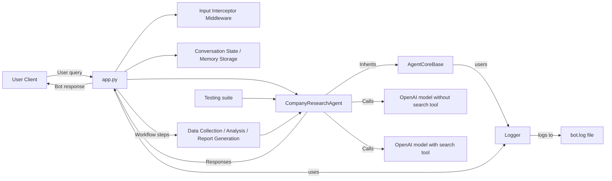

# Architecture Diagram

## Components

- app.py: Main entry point for the bot application, workflow routing, and middleware.
- agent_core/company_research_agent.py: Core AI logic for company research, analysis, and report generation.
- bot_logging.py: Centralized logging for diagnostics and monitoring.
- Conversation State / Memory Storage: Maintains workflow context across turns.
- Testing: Unit tests validate the research agent behavior.
