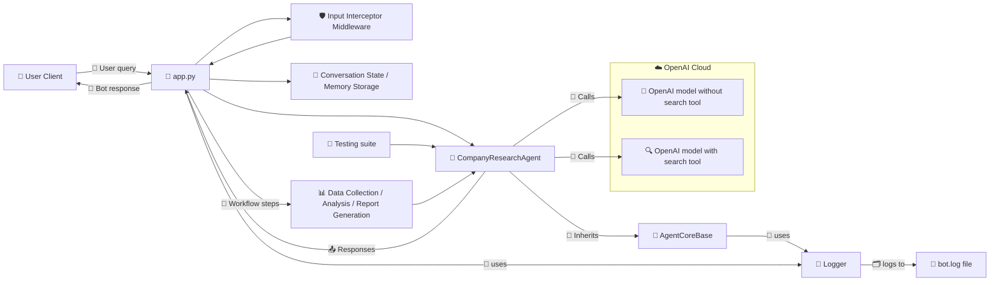

# 🗺️ Architecture Diagram

## 🧩 Components

- 📄 app.py: Main entry point for the bot application, workflow routing, and middleware.
- 🤖 CompanyResearchAgent: Core AI logic for company research, analysis, and report generation. Communicates with the cloud-based OpenAI model through the SDK.
- 📜 Logger: Centralized logging for diagnostics and monitoring.
- 🧠 Conversation State / Memory Storage: Maintains workflow context across turns.
- 🧪 Testing: Unit tests validate the research agent behavior.
- 🛡️ Input Interceptor Middleware: Validates user input.